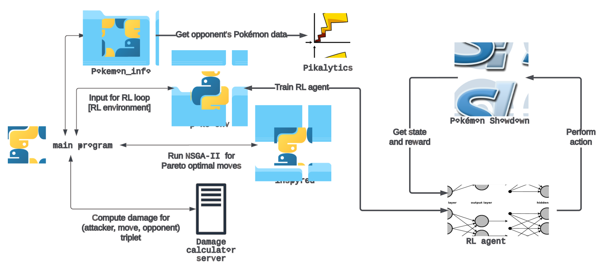
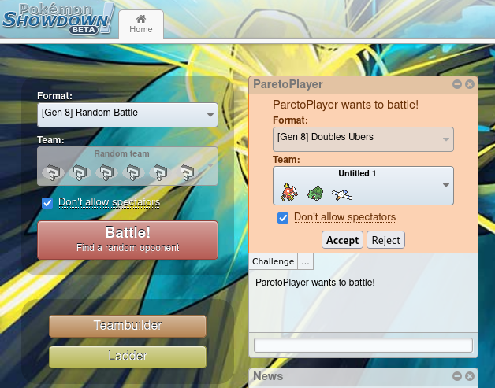
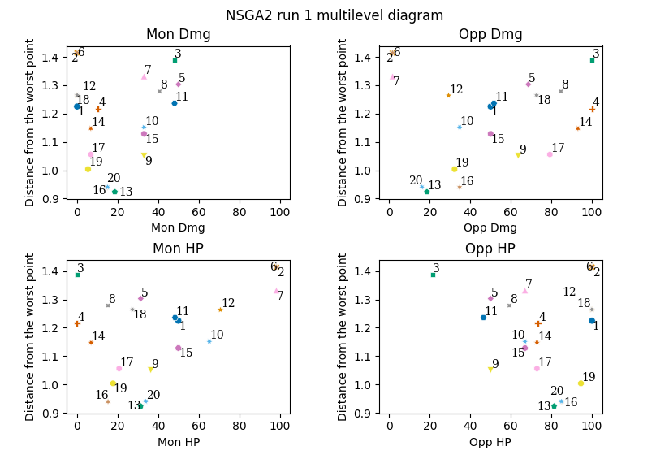
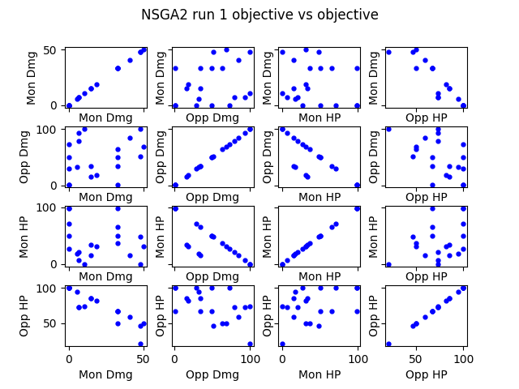
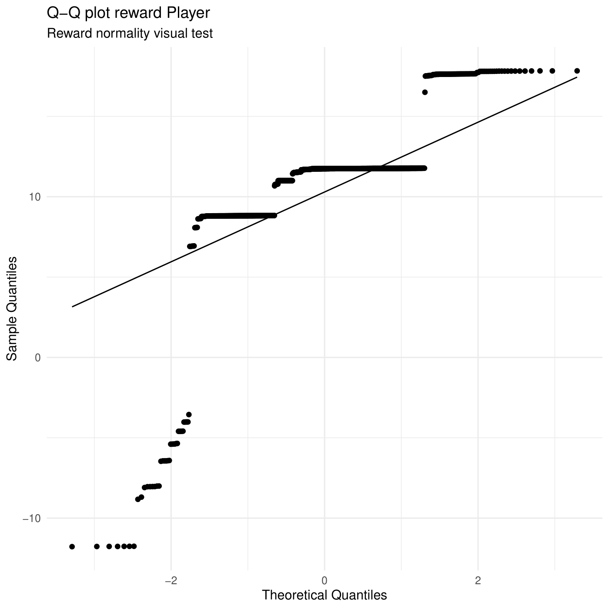
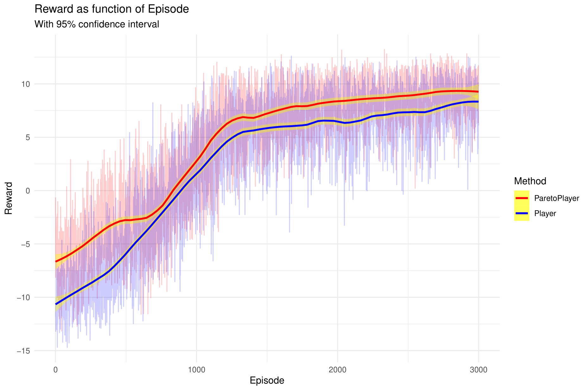

<!-- omit in toc -->
# Pareto Epsilon Greedy RL

Repository containing the project for the *Bio-Inspired Artificial Intelligence (BIAI)* course at the University of Trento.

<!-- omit in toc -->
## Table Of Content
- [About](#about)
- [Project description](#project-description)
- [Proposed Approach](#proposed-approach)
  - [Architecture](#architecture)
  - [Genetic Algorithm](#genetic-algorithm)
  - [Damage Calculator](#damage-calculator)
  - [Pokémon Showdown](#pokémon-showdown)
  - [Pikalytics](#pikalytics)
  - [Additional materials](#additional-materials)
- [Results](#results)
- [Usage](#usage)
  - [0. Set up](#0-set-up)
  - [1. Code documentation](#1-code-documentation)
  - [2. Server Installation](#2-server-installation)
  - [3. Starting the servers](#3-starting-the-servers)
  - [4. Pareto battle](#4-pareto-battle)
  - [5. Agent Training](#5-agent-training)
  - [6. Agent Testing](#6-agent-testing)
  - [7. Damage Calculator Unit Test](#7-damage-calculator-unit-test)
  - [8. Data analysis](#8-data-analysis)

## About

-   Authors :
    -   [Alghisi Simone](https://github.com/Simone-Alghisi)
    -   [Bortolotti Samuele](https://github.com/samuelebortolotti)
    -   [Rizzoli Massimo](https://github.com/massimo-rizzoli)
    -   [Robbi Erich](https://github.com/erich-r)
-   Licence : GPL v3+

## Project description
Nowadays, *Reinforcement Learning* is one of the most popular strategies to train agents able to play different games. In particular, *Deep-Q Learning* aims to achieve this by maximising the expected cumulative reward for future states (i.e. utility). However, while such strategy is problem agnostic, it requires an enormous amount of time to converge to a stable result. In Pokémon games, Double Battles have an extremely high complexity: in particular, there are at most $306$ different turn outcomes for each player. In this scenario, removing especially useless moves to speed up the training is fundamental. In this paper, we discuss the effectiveness of employing *NSGA-II*, a Genetic Algorithm, for training a Pokémon agent with a controlled search by solving a multi-objective optimisation problem.

## Proposed Approach
In this study, we have applied bio-inspired methods to enhance RL performances and speed up the learning process.  Firstly, we have devised a node server in order to compute the damage each move can deal. Secondly, we have set up *NSGA-II* so as to solve an optimisation problem and return the Pareto optimal moves the Pokémons can make in the current turn. Thirdly, we have designed an *Artificial Neural Network (ANN)* whose weights are learned through RL. Finally, we have evaluated our solution in terms of reward and winrate.

### Architecture


### Genetic Algorithm
To be able to train an agent as described above, we setup a multi-objective optimisation problem where we are trying to predict a set of non-dominated possible turn outcomes, by considering our moves and estimating the (optimal) one of the opponent. For this reason, 4 objectives are considered:

- *Mon HP*, i.e. the remaining HP of the Ally Pokémon after the turn has ended;
- *Mon Dmg*, i.e. the total damage inflicted by the Ally Pokémon to the Opponents;
- *Opp HP*, i.e. the remaining HP of the Opponent Pokémon after the turn has ended;
- *Opp Dmg*, i.e. the total damage inflicted by the Opponent Pokémon to the Allies;

### Damage Calculator
The damage a Pokémon move can inflict does not depend only on the statistics of the attacker and those ones of the defender but also on several other factors of the battle. Moreover, in the same battle scenario the move can have a different impact according to the Pokémon generation considered.

Therefore, to have reliable data, we have decided to compute the effects of a Pokemon move against an opponent by setting up a `node` web server infrastructure, which allows us to interface with a damage calculator Application Programming Interface (API) server. The `express` application can process several requests simultaneously with little latency, since it runs locally, obtaining exhaustive information thanks to the [Smogon Damage Calculator library](https://github.com/smogon/damage-calc).

### Pokémon Showdown
The training environment that we decided to use is [Pokemon Showdown](https://pokemonshowdown.com/), an online Pokémon battle simulator that can also also be deployed locally. In order to interface with it, we considered instead [`poke-env`](https://github.com/hsahovic/poke-env), i.e. a Python Library that handles the various communication with the Showdown Server, and allows to develop custom trainable agents by implementing OpenAI [`gym`](https://github.com/openai/gym).

### Pikalytics
In most of the cases, information regarding the opponent’s Pokémons is not known. Thus, to overcome this problem we have employed the data available on [Pikalytics](https://www.pikalytics.com/), which provides competitive analysis and team building help. Therefore, we created [`Pokemon_info`](https://github.com/massimo-rizzoli/Pokemon_info), i.e. a Python Library to get the most popular settings and moves for each Pokémon as determined by expert players. As a result, NSGA-II always has a decent knowledge of the opponent’s team because it considers the most likely moves under uncertainty

### Additional materials
A report describing in details the methodology that we've followed, the implementation choices, and the results, is available [here](./report/main.pdf).

Furthermore, the slides used for the project presentation to summarise and visually depict the idea are also available [here](./presentation/main.pdf).


## Results
Results show that ParetoPlayer is able to positively bias the training by providing higher rewards. However, when the search space is small enough and a single win condition is presented, Player outperforms ParetoPlayer. Due to a lack of resource availability and time, we were not able to study too in-depth all the components (i.e. we focused more on evaluating the proposed approach rather than searching for the best hyperparameters or network topology). Finally, at the moment the major problems are related to NSGA-II time-consuming operation, due to CPU and not GPU computation, and the inability of the trained agent to properly address forced switch, which should be handled separately from another network.


## Usage
To facilitate the use of the application, a `Makefile` has been
provided; to see its functions, simply call the appropriate `help`
command with [GNU/Make](https://www.gnu.org/software/make/)

``` shell
make help
```

However, if you feel more confident, you can still run the python commands listed below.

### 0. Set up

For the development phase, the Makefile provides an automatic method to create a virtual environment with your current python version.

If you want a virtual environment for the project, you can run the following commands:

```shell
pip install --upgrade pip
```

Virtual environment creation in the `venv` folder

```shell
make env
```

or alternatively

```shell
python -m venv venv/pareto
```

You can activate the virtual environment by typing

```shell
source ./venv/pareto/bin/activate
```

> **Note:** that the previously described steps are optional, you may decide not to set up a virtual environment, or to set it up as you prefer.

Install the requirements listed in `requirements.txt` and those ones listed in `package.json`

``` shell
make install
```

or alternatively

```shell
pip install -r requirements.txt
npm install
```

### 1. Code documentation

The code documentation and the code formatting requires the development dependencies, therefore if you are interested in these functionalities you need to install the libraries listed in `requirements.dev.txt`.

```shell
make install-dev
```

or alternatively

```shell
pip install -r requirements.dev.txt
```

The code documentation is built using [Sphinx
v4.3.0](https://www.sphinx-doc.org/en/master/). 
Since the `Sphinx` commands are quite verbose, we suggest you to employ the `Makefile`.

If you want to build the documentation, you need to enter the project folder first:

``` shell
cd pareto_rl
```

Build the Sphinx layout

``` shell
make doc-layout
```

Build the documentation

``` shell
make doc
```

You can open the documentation, which once it has been created it be located in `docs/build/html/index.html`, with you default browser by typing

``` shell
make open-doc
```

### 2. Server Installation
For most of the operations, you need to make sure that both a *Damage Calculator* and a *Pokémon Showdown* instance are running locally on specific ports on your machine. 

First, if you have not done it yet, you need to install both Pokémon Showndown and the requirements of the Damage Calculator server.

This can be easily achievable employing the Makefile in the following way:

``` shell
make install-showdown
make install-damage-calc-server
```

alternatively you can install them on your own by typing

```shell
git clone https://github.com/smogon/pokemon-showdown.git; \
    cd pokemon-showdown; \
    npm install; \
	cp config/config-example.js config/config.js; \
	sed -i 's/exports.repl = true/exports.repl = false/g' config/config.js; \
	sed -i 's/exports.noguestsecurity = false/exports.noguestsecurity = true/g' config/config.js

cd damage_calc_server; \
    npm install
```

> **Note:** the additional command in the `pokémon-showdown` installation are needed in order to make the server work locally. Moreover, Pokémon Showdown should be placed inside the project folder. 

### 3. Starting the servers
You can get the servers running with the employment of the Makefile by executing 

```shell
make start-showdown
make start-damage-calc-server
```

Instead, without the Makefile you can run

```shell
cd pokemon-showdown; \
    npm start --no-secure

cd damage_calc_server; \
    npm run build; \
    npm run start
```

A Pokémon Showdown instance should be running on `http://localhost:8000`, while the a Damage Calculator instance should be running on `http://localhost:8080`.

### 4. Pareto battle
You can challenge the `ParetoPlayer` in a battle on your local Pokémon Showdown instance with your team. To do that, you first need to start both servers as described above.

Finally, you can start the Pokémon battle, making sure that the `PARETO_BATTLE_FLAG := --player` variable in the Makefile is equal to your Pokémon Showdown player's name.

```shell
make pareto-battle
```

or alternatively you can call

```shell
python -m pareto_rl pareto-battle --player [YOURPLAYERNAME]
```

once the command has been entered you will receive a challenge from the ParetoPlayer in the Pokémon Showdown browser window:



by clicking accept you will challenge the ParetoPlayer.

After the battle has been completed for each turn that the battle has lasted two plots concerning `NSGA-II` performances are displayed, namely:

- a multi-level diagram which shows the distance from the worst individual according to each objective for the non-dominated Pareto front population after a normalisation ([L2 norm](https://mathworld.wolfram.com/L2-Norm.html)):


- a matrix plot which shows how the Pareto front is shaped objective against objective:


> For more information you can call the consult the help functionality
> ```shell
> python -m pareto_rl pareto-battle -h
> ```

### 5. Agent Training
To effectively train the Reinforcement Learning agent you have to start, as described in [Starting the servers](#3-starting-the-servers), a Pokemon Showdown and a Damage Calculator server instance. 

Once you are ready, you can train the agent by typing

```shell
make train
```

or alternatively 

```shell
python -m pareto_rl rlagent
```

During the training the agent will challenge `DoubleMaxDamagePlayer`, a simple player which will always choose the move that deals the highest damage to opposing Pokémons.

**Note** that there is no explicit distinction between *Player* and *ParetoPlayer* in the code, as the agent will perform pareto optimal actions with a given probability described by the `"pareto_p"` argument in the `args` dictionary of the `main` function in [`pareto_rl/dql_agent/agent.py`](pareto_rl/dql_agent/agent.py) file.

By default the probability of carrying out a move computed by `NSGA-II` is equal to $0.7$, which means that the agent which will be trained is a *ParetoPlayer*. 

To switch from *ParetoPlayer* to *Player*, therefore to set up a classic Deep Q-Learning agent, you can change that probability to $0$ and run the training command.

Since the agent is trained by performing battles on Pokémon Showdown it is possible to join its battles or watch the replays.

> For more information you can call the consult the help functionality
> ```shell
> python -m pareto_rl rlagent -h
> ```

### 6. Agent Testing
To test the Reinforcement Learning agent you have to start, as described in [Starting the servers](#3-starting-the-servers), a Pokemon Showdown and a Damage Calculator server instance. 

During the tests the agent will challenge `DoubleMaxDamagePlayer`.

To test the agent you need to change the `RUN_NUMBER` variable in the Makefile according to which run you are willing to evaluate and then run

```shell
make test
```

or alternatively

```shell
python -m pareto_rl rlagent --test RUN_NUMBER [--fc {winrate, reward}]
```

where `RUN_NUMBER` is the run identifier which identifies the weights of the model to load

By default the tested agent will be the one with the higher `episode reward` obtained in the evaluation of the model. However, you can change the behaviour by setting `--fc` to winrate.

Likewise the training, the agent is tested by performing battles on Pokémon Showdown, therefore it is possible to join its battles or watch the replays.

### 7. Damage Calculator Unit Test
To assess the correctness of the Damage Calculator combined with the data retrieved from poke-env, we have developed some simple tests which can be found in the `test` folder.

To run the tests you can run

```shell
make unittest
```

or alternatively

```shell
python -m unittest discover -s test
```

### 8. Data analysis
To analyse the quality of the result obtained we have devised some scripts in `R` language which are located inside the `analysis` folder.

To install the needed requirements you need to run

```shell
Rscript requirements.R
```
The tests we have devised are:

- [`normality.R`](analysis/normality.R) which tests the normality of the difference between data coming from the rewards of two reinforcement learning runs by default. It produces a [`Q-Q plot`](https://en.wikipedia.org/wiki/Q%E2%80%93Q_plot) and the results of the [`Shapiro-Wilk test`](https://en.wikipedia.org/wiki/Shapiro%E2%80%93Wilk_test) and the [`Kolmogorov-Smirnov nomality test`](http://www.real-statistics.com/tests-normality-and-symmetry/statistical-tests-normality-symmetry/kolmogorov-smirnov-test/). As an effective representation a produced `Q-Q plot` looks like this: 
- [`regression.R`](analysis/regression.R) which produces a regression line from the average episode reward of two reinforcement Learning agents training \[OBSOLETE\].
- [`10_runs_agg.R`](analysis/10_runs_agg.r) which produces a regression line from the average episode reward of two reinforcement Learning agents training and runs a [`Kolmogorov-Smirnov test`](https://en.wikipedia.org/wiki/Kolmogorov%E2%80%93Smirnov_test).  As an effective representation a produced `Q-Q plot` looks like this: 
- [`significance_if_not_normal.R`](analysis/significance_if_not_normal.R) which runs a [Wilcoxon rank-sum test](https://en.wikipedia.org/wiki/Mann%E2%80%93Whitney_U_test) on the episode reward data of the two models evaluation;
- [`significance_if_normal.R`](analysis/significance_if_normal.R.R) which runs a [Student's t-test](https://en.wikipedia.org/wiki/Student%27s_t-test) on the episode reward data of the two models evaluation.

For more information about the statistical tests we have employed you can check [the analysis README](./analysis/README.md).